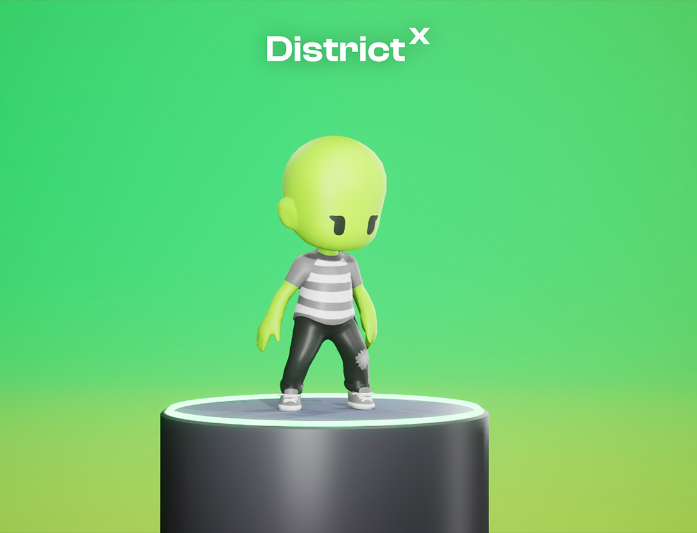

# District X

## Description

A self-expression social platform that combines customizable 3D avatars with anonymous discussions now utilizing Three.js. See legacy branch if you's like to see the project when it was running in Unreal Engine 5!

## Video Preview (Click the image)

[](https://youtu.be/P4qbp1i7nEw)

## Installation 📥

To set up the frontend and backend dependencies, from the Client directory, run:

```
$ npm install
```

To run the client side...

```
npm start
```

To start the server and to see how the React application and Flask API are interacting, you can run the Flask application in one terminal by running the following prompt from the `server/` directory:

```
$ python app.py
```

## Important to note 📝

The avatar character customization _USED_ to run in the URE editor. I'm currently working on getting this whole application to solely be web-based. Not everything is connected at the moment, so feel free to just navigate to /home, or if you want to check out the current state of the avatar customization page navigate to /customizer. On the /customizer route if you click on the 'Finalize Avatar' button, you'll be navigated to the home page!

```
http://localhost:4000/home
```

or...

```
http://localhost:4000/customizer
```

Thumnails are automatically generated when the character customization process is complete so if you bypass this part, there won't be any thumbnails for any of the users. You won't be able to view your own or other avatars via their profile pages.

## Roadmap 📍

Future additions include:

- Coins for each user to indicate social status given by the community bases on posts / comments made
- Limit thr amount of upvotes/downvotes a user can give on a single post/comment.
- Expand Districts.
- Allow users to create Districts.
