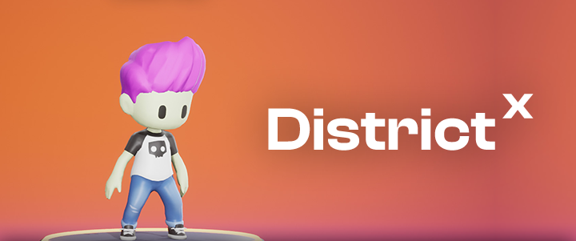

# District X



## Description

A self-expression social platform that combines customizable 3D avatars with anonymous discussions utilizing Unreal Engine 5.

## Installation 📥

To set up the frontend and backend dependencies, from the Client directory, run:

```
$ npm install
```

To run the client side...

```
npm start
```

To start the server and to see how the React application and Flask API are interacting, you can run the Flask application in one terminal by running the following prompt from the `server/` directory:

```
$ python app.py
```

## Important to note 📝

The avatar character customization happens in URE editor. If you're soley on the web application, you will be met with a blank white page. To get pass this naviagte to...

```
http://localhost:4000/home
```

Thumnails are automatically generated when the character customization process is complete so if you bypass this part, there won't be any thumbnails for any of the users. You won't be able to view your own or other avatars via their profile pages.

## Roadmap 📍

Future additions include:

- Coins for each user to indicate social status given by the community bases on posts / comments made
- Limit thr amount of upvotes/downvotes a user can give on a single post/comment.
- Expand Districts.
- Allow users to create Districts.
